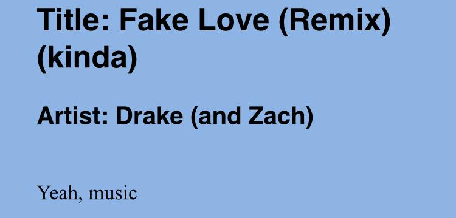

# I'm Just Gonna Write You a Love Song

Cuz where else are you going to get quality lyrics like this?

### Setting up
1. Modify `start_urls` in  `{project}/lyric_scraper/lyric_scraper/spiders/{spider}` so that it contains the URLs of the artists whose songs you want to scrape.
1. Start the scraper by changing directories to `{project}/lyric_scraper/` and running `scrapy crawl {spider_name} -o ../data/songs/batch/{target_filename}.json`
1. Clean out any of the files you don't want from `{project}/data/songs/batch/`
1. Run `python {project}/scripts/extract_artists.py`
	1. This will ask you to fix any titles and artists that couldn't be scraped.
	1. Then, it will separate the batch files into artist files

# Project Title: I’m Just Gonna Write You a Love Song
## (Project Proposal for CS 175, Winter 2017)
Team Member(s): Zachary Lee, 55104210, zalee@uci.edu
## Project Summary  
This project will use Markov chains and part-of-speech replacement techniques to synthesize song lyrics using a data set of song lyrics scraped from the Internet. The project will be evaluated for improvement with the use of user studies.

## Problem Definition
Very often, songwriters have an overarching vision for songs and instrumentals that they want, but they don't have lyrics yet. Lyric writing can be difficult because it is constrained by many different factors. In order for song lyrics to seem "human", each phrase usually needs appropriate syllabic counts, passable syntactic structure, and semantic consistency. This project will take a collection of an artist’s songs and generate song lyrics in his or her style.

## Proposed Technical Approach
The song lyrics will be mined from a website using a web crawler and scraper to build a corpus of lyrics. The corpus will be passed to a model to train it, and then the model can be given input data to generate song lyrics.
There are two types of input for the model: the training data set and the seed data (gives the algorithm some information to start building from). 
The system can currently use all songs from a single artist as training data. With that, it’s not hard to combine multiple artists into a single training set simulating a lyrical “mashup” or collaboration between those artists. I’m also considering using entire genres as training sets, which will greatly increase the amount of training data, but has difficulties and will be covered in Section 7.
For the seed data, there are many options to consider. I might have the system choose the seed itself. Perhaps a single word or whole line randomly selected from an already-existing song could be used to as a seed. Alternatively, I could take user input to seed the process. Users could enter a few words and then the model will try to “auto-complete” their song. Users could enter a few words and the model will fit each of the words somewhere into the song. If I have enough time, I would also like to try allowing users to input a theme or topic and have the model develop a semantic understanding to focus the lyrics of the song around that theme, most likely by upweighting words that are associated with that topic.
At its core, the model will use two techniques: Markov chains and part-of-speech replacement. The Markov chains will use previous words to generate words that are likely to appear next, with training set words upweighted. Part-of-speech replacement will help create sentences that are similar in structure to sentences found in the training data. I plan to use Google n-grams to train the Markov chains, either bigrams or trigrams. I also plan to use a probability distribution of word counts or syllable counts to constrain sentence lengths to keep lines to reasonable lengths. I’m interested in seeing the effect of preselecting starting and ending words for lines and for verses. There are specific types of words that belong in those places and it might improve the flow of the lyrics and make them seem more human.

## Data Sets
I am using Google N-grams (http://storage.googleapis.com/books/ngrams/books/datasetsv2.html) and data scraped from www.metrolyrics.com. I can expand my dataset easily in the future, but at the moment I am working with a collection of 18 artists’ songs who are searched the most on metrolyrics: Ed Sheeran, Bruno Mars, Disney, Coldplay, Adele, Rihanna, Eminem, Justin Bieber, Taylor Swift, Lady Gaga, Drake, Marron 5, Katy Perry, Michael Jackson, The Weeknd, Prince, Chance the Rapper, and Imagine Dragons. This collection of lyrics contains 1300 documents, with an average of 422.06 tokens per document.

## Experiments and Evaluation
I plan on utilizing user evaluation to improve this project. I will set up a website that allows users to compare two different song lyrics and choose the one they think is better. I will generate both passages with the exact same starting parameters, but they will be different versions of the algorithm. I am going to slot in different techniques to see if including those techniques increases popularity with users.

## Software
	1. code I have written
	* lyric_scraper
		* parses webpages to generate a set of links to lyric pages
		* parses lyric pages to find essential elements from the html
		* scrapes the title, author, and lyrics from the webpage
		* cleans the extracted text and stores it in a local file
	1. code written by others
	* scrapy: https://scrapy.org/ 
		* skeleton for webcrawler
	* nltk: http://nltk.org/
		* toolkit for processing language
		* used for tokenization
	1. code I plan to write/use
	* google n-grams: http://storage.googleapis.com/books/ngrams/books/datasetsv2.html
		* used to help train markov chains
	* flask: http://flask.pocoo.org/
		* Python server that handles http requests
	* scikit-learn: http://scikit-learn.org/
		* tools for data analysis and machine learning

## Challenges Identified
I originally started out scraping www.azlyrics.com, but they banned my IP every time I scraped more than 120 pages, regardless of speed. I tried using proxies, randomizing my user agent, and using a VPN, but these all failed. I worked on it on and off over the course of a day, and it was a frustrating day.
One benefit that azlyrics has over other lyric sites is that it is very simple in style. There isn’t a lot of hierarchy to dig through on their website, so finding and extracting elements was easy. I had to learn css and xpath selectors and search for advanced tools to correctly extract elements from the new page, metrolyrics. And even then, it’s a lot of trial and error.
I also want to use genres to build training sets. Unfortunately, artists’ styles tend to evolve, so I can’t classify all of an artist’s songs into the same genre. Therefore I would need to label every song on an individual basis, but I cannot find a database that links song titles to genres. I could search wikipedia and scrape the genre off of those pages, but most sites ban crawlers from using their search functions. I can’t programmatically create URLs to crawl on wikipedia because there is no standard for song pages. Sometimes they follow the form “{song title}_(Song)”, sometimes “{song title}_(Artist_Song)”, sometimes “{song title}”, as well as several variations. In addition, a good portion of the data I scraped is not formatted following the structure of most other pages on the site. User-generated content is messy!

8. Updated Milestones
End of Week 8: Basic model created.
End of Week 9: Website up and running. Available to the public.
End of Week 10: Results being analyzed and constant improvement to algorithm.
